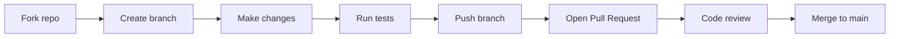

# Contributing to AsynxDL

Thank you for your interest in making AsynxDL better! This document explains how to contribute code, report bugs, suggest features, and follow the project's style guidelines.

---

## Table of Contents

1. [Getting Started](#getting-started)
2. [How to Contribute](#how-to-contribute)
3. [Development Workflow](#development-workflow)
4. [Code Style](#code-style)
5. [Testing](#testing)
6. [Reporting Bugs](#reporting-bugs)
7. [Security](#security)
8. [Licensing](#licensing)

---

## Getting Started

1. **Fork** the repository on GitHub.
2. **Clone** your fork locally:
   ```powershell
   git clone https://github.com/asynx6/Asynx-Donwload-Manager.git
   cd Asynx-Donwload-Manager
   ```
3. **Install dependencies**:
   ```powershell
   pip install -r requirements.txt
   ```
4. **Run the app from source**:
   ```powershell
   python -m backend.main
   ```

---

## How to Contribute

### Small fixes (typos, docs, comments)

You can open a Pull Request directly for minor changes.

### New features or bug fixes

1. Create a new branch from `main`:
   ```powershell
   git checkout -b feature/your-feature-name
   ```
2. Make your changes in small, focused commits.
3. Add or update tests if your change touches core logic.
4. Run the test suite locally:
   ```powershell
   python -m pytest tests/ -v
   ```
5. Push your branch and open a **Pull Request** against `main`.
6. In the PR description, explain:
   - What changed
   - Why it changed
   - How to test it

### Suggesting features

Open a **GitHub Issue** with the label `enhancement` and describe:
- The use case
- The expected behavior
- Any alternatives you considered

---

## Development Workflow



---

## Code Style

- **Python version:** 3.11 or newer (the project currently targets 3.14).
- **Type hints:** Use them for public functions, classes, and method signatures.
- **Docstrings:** Add docstrings for modules, classes, and public methods.
- **Line length:** Keep lines under 100 characters when possible.
- **Windows paths:** Use `os.path.join` or raw strings (`r"..."`) for paths to avoid escape-sequence bugs.
- **UI thread safety:** Never update CustomTkinter widgets from background threads. Use the `queue`-based UI scheduler or `widget.after()` from the main thread.
- **Error handling:** Catch specific exceptions. Log unexpected errors to the crash logger instead of silently swallowing them.

---

## Testing

```powershell
python -m pytest tests/ -v
```

If you add new behavior, include a test in `tests/` that covers the happy path and at least one failure mode.

---

## Reporting Bugs

A good bug report should include:

- **Windows version** (e.g., Windows 11 24H2)
- **App version** (see `dist/AsynxDL.exe` details or `git log`)
- **Steps to reproduce** the issue
- **Expected behavior** vs. **actual behavior**
- **Relevant logs** from `%LOCALAPPDATA%\AsynxDL\logs\`
  - `app.log`
  - `crash-*.log`
  - `state.log`

Attach screenshots or screen recordings if they help explain the problem.

---

## Security

If you discover a security vulnerability (e.g., path traversal, command injection, arbitrary file write), please **do not** open a public issue. Instead, contact the maintainers privately or open a **Security Advisory** on GitHub.

When reviewing code, pay special attention to:
- Input validation on URLs and file paths
- Proper escaping before shell/subprocess calls
- File write permissions and path traversal protection
- API token handling and authentication

---

## Licensing

By contributing to AsynxDL, you agree that your contributions will be licensed under the [MIT License](LICENSE).

---

## Questions?

Feel free to open a **GitHub Discussion** or issue if anything is unclear. We are happy to help new contributors get started.
